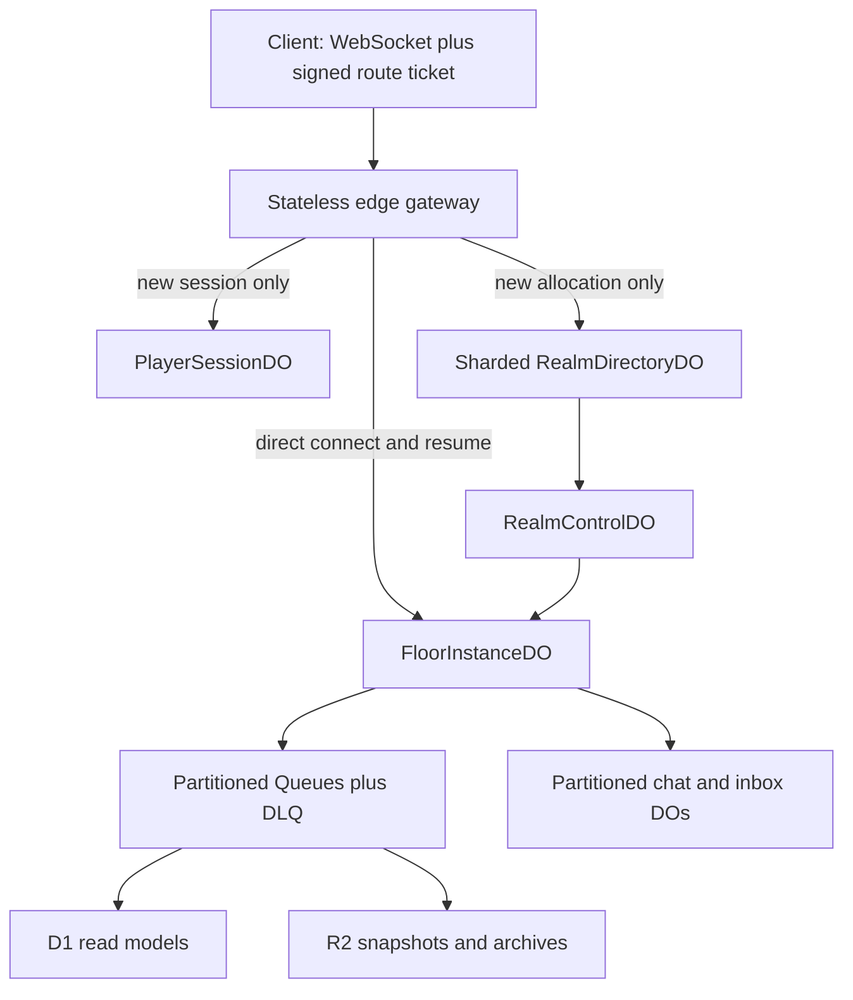

# ADR 0001: Shard authoritative gameplay across Cloudflare Durable Objects

- Status: accepted for implementation; not approved for production traffic
- Date: 2026-07-10
- Decision owner: project owner, delegated through the production-readiness task
- Scope: architecture and an undeployed local scaffold only

## Context

GrokHack currently has one authoritative Node process, one local DuckDB database,
and one Cloudflare Tunnel origin. The Kubernetes manifest also explicitly limits
the game StatefulSet to one replica. That topology has a single failure domain
and a single serialization point. It cannot support a million concurrent players
or an end-to-end 99.99% application SLO.

The existing product language says every depth is one shared dungeon. Literal
global ordering across ten maps would place all gameplay behind ten hot
single-threaded coordinators. That is incompatible with million-user scale.

Cloudflare's documented control-plane/data-plane pattern instead routes the hot
path directly to many resource objects. Durable Objects are the correct local
coordination primitive, but an individual object has a soft throughput ceiling
and must remain bounded:

- [Durable Object limits](https://developers.cloudflare.com/durable-objects/platform/limits/)
- [Durable Object control/data-plane pattern](https://developers.cloudflare.com/reference-architecture/diagrams/storage/durable-object-control-data-plane-pattern/)
- [Durable Object placement](https://developers.cloudflare.com/durable-objects/reference/data-location/)

## Decision

Use a hierarchical, sharded architecture with no global singleton and no
directory object in the gameplay hot path.

### Product semantics

GrokHack remains one persistent universe for identity, friends, parties, guilds,
moderation, discovery, events, and leaderboard namespaces. Strongly ordered
gameplay is local to a bounded realm and floor instance.

- Everyone in the same realm/floor instance shares that dungeon.
- Parties are assigned together. Friends can join when capacity permits.
- Popular places may have multiple coherent instances.
- Global chat, presence, leaderboards, analytics, and event totals are
  eventually consistent.
- Players do not all occupy one million-player broadcast or combat domain.

### Ownership boundaries

| Component | Owns | Must not own |
|---|---|---|
| Edge gateway Worker | ticket validation, schema/frame validation, admission routing, WAF/rate-limit integration | mutable gameplay state |
| `PlayerSessionDO` | identity lease, session epoch, current route, transfer receipt, resume fencing | ordinary gameplay commands or permanent socket fanout |
| Sharded `RealmDirectoryDO` | capacity-aware assignment for new sessions | gameplay hot-path requests |
| `RealmControlDO` | realm seed, ruleset/content hash, lifecycle, floor epochs | movement/combat ordering |
| `FloorInstanceDO` | deterministic simulation, live players/entities, command order, durable dedupe/replay window, direct hibernating sockets | global leaderboards or synchronous third-party calls |
| Chat/inbox DOs | partitioned ordered channels and owner-scoped delivery | combat authority |
| Queues | idempotent audit, projection, bridge, analytics, and archive delivery | synchronous command acknowledgement |
| D1 | queryable global projections | combat or inventory truth |
| R2 | immutable content, replay segments, independent snapshots, restore artifacts | synchronous gameplay dependencies |

### Command invariant

For every accepted state-changing command, one `FloorInstanceDO` must:

1. Validate `(playerId, sessionEpoch, authorityEpoch, leaseId, clientSeq)` and
   the active route/connection fence.
2. Return the previously committed response for an in-window duplicate.
3. Apply one deterministic transition.
4. Commit state, the dedupe record, and critical outbox records atomically.
5. Acknowledge only after the commit succeeds.
6. Broadcast bounded interest-managed deltas, not a complete floor snapshot.

No network request or third-party dependency belongs inside that transaction.

Cross-floor movement is a fenced, idempotent saga. Interrupted transfer may
temporarily leave a player reconnecting, but it must always leave exactly one
authoritative avatar and must never duplicate inventory or currency.

### Initial capacity hypothesis

Capacity is based on peak concurrent users, not registrations or MAU.

Let:

- `C` = peak concurrent players;
- `lambda` = accepted commands per player per second;
- `P` = admitted players per floor object;
- `F` = average recipients per delta;
- `R_safe` = measured safe inbound commands per object per second;
- `O_safe` = measured safe outbound frames per object per second.

Then:

`required objects = max(ceil(C/P), ceil(C*lambda/R_safe), ceil(C*lambda*F/O_safe))`

The starting test hypothesis is `P=100` and `R_safe<=200`, further limited to
40% of the measured saturation knee. At one million concurrent players and two
commands per second, that implies at least 10,000 active gameplay objects and
two million accepted commands per second before outbound fanout is considered.
These are sizing hypotheses, not proven capacity claims.

## Alternatives rejected

### A. One global Durable Object

Rejected. It creates a hot partition, catastrophic failure domain, unbounded
fanout, and a throughput ceiling orders of magnitude below the target.

### B. One realm object plus one globally shared object per depth

Rejected as the final design. Ten globally shared floor objects remain ten hot
partitions. A realm/floor object is valid only when the realm is bounded and
additional instances can be allocated horizontally.

### Proxy the legacy Node server through a Worker

Rejected. It changes ingress location without removing the single process,
single world, local database, or tunnel failure domain.

### D1 or Queues as gameplay authority

Rejected. D1 is a global read-model store here; Queues are asynchronous and
at-least-once. Neither belongs in an immediate strongly ordered combat path.

## Council record

The local design-council process used three independent voices:

- Product voice: chose Option C; one persistent universe with honest bounded
  local interaction, party co-location, and visible capacity/transfer states.
- Implementation voice: chose Option C; direct floor sockets, SQLite state,
  additive protocol v3 authority claims, deterministic reducer extraction, and shadow replay.
- Operations voice: chose Option C; explicit SLO/error budget, overload
  brownouts, independent probes, account-limit validation, and cohort rollback.

All three rejected a global Durable Object and an unbounded object per depth.

### 2026-07-11 allocation and retirement follow-up

Authority preflight: the project owner delegated autonomous production-readiness
design within an undeployed local branch. This choice is additive and reversible;
it does not create resources, route traffic, mutate production data, spend money,
or change a live service. Production adoption remains separately approval-gated.

The council compared three allocation-control shapes:

1. One directory for an entire realm. Rejected because allocation bursts and
   retirement polling would create a realm-wide serialization and failure point.
2. A deterministic set of directory buckets, each owning capacity reservations
   and the lifecycle of its own floor slots. Chosen because retries and lifecycle
   decisions stay strongly ordered inside one bounded object while gameplay goes
   directly to `FloorInstanceDO`.
3. Separate sharded directories plus a realm-wide lifecycle coordinator. Deferred
   because it adds an allocation saga and recreates a shared coordinator before
   realm seeds, rules, and content rollout actually require one.

The product voice requires party affinity, explicit capacity responses, and a
fresh assignment when an epoch is retired. The implementation voice requires a
power-of-two deterministic bucket, exact-operation receipts, short bounded
reservations, a maximum of four capacity probes, and epoch-fenced slot rotation.
The operations voice requires draining before rotation, conservative capacity
accounting, overload signals, bounded tables, structured decisions, and a
rollback that can disable the issuer route without touching direct floor traffic.

Each directory is named from `(allocatorLayoutVersion, environment,
locationHint, realmId, depth, bucketCount, bucket)`. Its bucket is derived from
`partyId` when present and otherwise from `playerId`. Floor instance IDs also
encode layout, location, and bucket count so historical layouts and location
hints cannot alias the same named Floor object. It owns only new-allocation work:
floor slot/epoch rows, expiring affinity reservations, and bounded idempotency
receipts. The active bucket count plus an explicit supported historical window
allow old layouts to retire after a shard-count migration without accepting
arbitrary layouts for new allocations.

A read-only floor capacity RPC reports unique joined/pending players, raw
sockets, durable session count, frozen source exports, prepared target imports,
and whether tombstone retirement is required. Opaque, short-lived reservation
IDs in additive protocol-v4 claims let the directory subtract only the exact
joined portion of a still-live reservation; live players and unrelated pending
reservations are never collapsed with an unsafe `max`. A directory stops new
assignments to a draining epoch. Its bounded alarm loop waits for reservations,
live/pending sockets, frozen exports, and prepared imports, then durably advances
the Floor through `active -> draining -> retired` before rotating the slot.
Stale retirement requests are fenced by the current
`(slot, floorInstanceId, floorEpoch)` tuple.

The internal Worker API authenticates the exact method, path, timestamp, key ID,
and raw body with the active/previous control keyring before parsing or dispatch.
It returns an assignment, not a browser route ticket, so issuer/session authority
and the existing protocol-v4 ticket boundary remain separate. Validation must
cover response-loss replay, concurrent reservations, affinity, capacity rollover,
overload, eviction, stale epochs, adjacent schema expansion, bounded retention,
and deterministic bucket properties before this decision can advance beyond a
local scaffold.

The adversarial implementation review reproduced and closed four defects before
the local scaffold was accepted: joined reservations were double-counted,
concurrent duplicate requests could create unused slots, allocator-observed
draining epochs leaked without a recovery loop, and old bucket-count layouts
became unretirable after configuration changes.

## Assumptions requiring validation

- Cloudflare approves the expected concurrent WebSocket count, object ramp rate,
  queue layout, and full-scale load-test window for the selected account plan.
- A bounded realm/floor product model is acceptable; literal global synchronous
  interaction is not required.
- The deterministic engine can be extracted from the Node server without
  changing gameplay behavior.
- Parties can be assigned together without turning a directory into a hot path.
- Cost at the measured message/fanout rate is sustainable.

## Evidence collected

The undeployed [`edge`](../../edge/README.md) slice already exercises the final
data-plane shape rather than proxying the origin:

- current Wrangler 4 configuration and generated runtime/binding types;
- environment/audience/key-bound HMAC route tickets carried outside query
  strings, with one-time floor admission and explicit join deadlines;
- direct hibernating floor WebSockets that survive object eviction;
- SQLite pending-to-active connection fencing, monotonic SLO-probe commits,
  bounded dedupe, and retained sequence tombstones;
- explicit capacity rejection, per-socket and floor-wide token buckets, and
  bounded UTF-8 measurement without a proportional second allocation;
- active/previous ticket-key verification, higher-epoch pending recovery,
  alarm boundary cleanup, and a hard session-tombstone retirement threshold;
- a named SQLite `PlayerSessionDO` that idempotently binds one exact signed
  authority tuple, rejects uncommitted cross-floor/takeover attempts, and
  coordinates a source-bound transfer/takeover saga with alarm recovery;
- a sharded SQLite `RealmDirectoryDO` with exact raw-byte control authentication,
  party affinity, four-probe admission, reservation/live reconciliation,
  bounded receipt pressure, historical-layout support, and alarm-driven epoch rotation;
- Workers-runtime tests for tampering, UUID aliasing, global binding,
  cross-floor transfer, same-floor takeover, response-loss retry, concurrent
  phase races, malformed input, duplicate replay, delayed supersession,
  capacity, rate/frame boundaries, schema expansion, bounded storage, alarm
  expiry, allocator response loss, duplicate/party concurrency, tombstone and
  transfer-blocked retirement, stale signed epochs, persisted reconstruction,
  and live hibernation;
- a frozen-V1/mixed-V2 shadow replay path for shared movement decisions with
  independent state and behavioral-event divergence evidence, exact duplicate
  replay, eviction, and adjacent `shadow_entries` schema expansion;
- Wrangler dry-run bundling only; no deploy or resource creation.

## Not proven

- The deterministic turn/vitals reducer runs in the undeployed Floor object and
  movement decisions run only in isolated shadow replay; full gameplay reducers
  and authoritative edge position are not implemented.
- Existing browser/agent/social/resume protocol parity is not complete.
- Cross-floor/shared-vitals transfer and same-floor takeover are locally proven,
  but complete avatar/inventory parity and a production issuer/control plane are
  not. Issuer-side key-rotation operations remain.
- Queues, D1 projections, R2 backup, and restore do not exist yet.
- Per-object capacity, million-connection scale, cost, geographic behavior, and
  a 99.99% application SLO have not been demonstrated.
- No Cloudflare account limits, contracts, paid resources, DNS, or routes were
  changed.

## Stop conditions before traffic

Do not route players or make scale/reliability claims while any of these remain:

- a global or realm singleton sits in the command hot path;
- shard capacity is inferred rather than measured;
- overload, deployment, binding, or dependency failures are excluded from the
  application SLI;
- reconnect/resume can lose or double-apply acknowledged commands;
- state migrations cannot be drained or rolled back safely;
- no independent synthetic monitoring and off-platform SLO record exists;
- no PITR plus independent restore drill has passed;
- Cloudflare has not confirmed account-scale and load-test requirements.

## Consequences

This decision adds substantial migration and operations work, but it converts
scale and failure isolation into horizontal, measurable properties. It also
forces the product to describe “massively online” honestly: millions in one
persistent service, with bounded local interaction—not one global synchronous
room.
